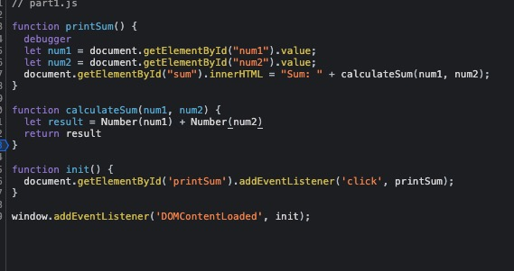
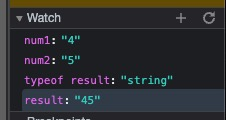
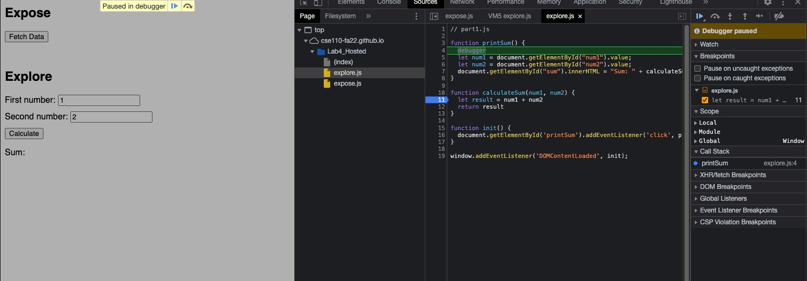

1. The ```num1``` and ```num2``` from the input field are treated as strings, the ```result``` is not the sum of two inputs but the concatenation of two strings, which is not what we expected.
2. I would try to convert data type of ```num1``` and ```num2``` from string to number when initialize the local variable ```result``` with bulit-in function ```Number()```



